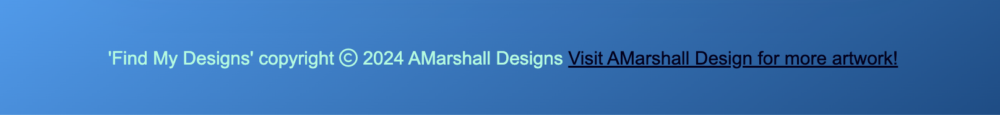

# Find My Designs

Welcome to Find My Designs, this is your invitation to have a little fun with someone who lives and breaths character design and has a wonderful, colorful, visually stunning art style. 
This game was designed as a new way to showcase some of my artwork and as a little bit of fun in relation to the fun artstyle that I create. 

This site is targeted towards anyone who is looking for a fun little game to play, something to help pass a little bit of time. The site will also be useful to the user as it showcases the style of art the creator produces and what sort of projects they are used to working with.

You can visit my live site [from here](https://uctv9805.github.io/msp-2-memory/)

## Planning Stage

### Target Audiences:

- Anyone who likes playing fun games. 
- All age groups down to at least 5 years old due to simple nature of game (as tested by my 5 year old).
- Followers of the artist who appreciate his work.

### User Stories:

- As a user, I want to play a fun game.
- As a user, I want to be able to check my score.
- As a user, I want to know how fast I was when completing the game.
- As a user, I want to know when I have won the game.

### Site Aims:

- To provide the user with a fun, visually pleasing game to play.
- To make the game interactive and satisfying to play.
- To encourage players to play again by showing scores and times so they can attempt to beat the previous score. 
- To show the user some of the artists artwork.

### How this is achieved:

- A simple memory game was created which is fun to play as the timer and score function offer replayability as it creates a desire to play again. The colours and layout have been thought about to make the site nice to look at. 

- The buttons and cards in the game are clickable and have animations/transitions added so the game feels responsive and satisfying to play.

- Some of the artists artwork has been added to the background so it is inkeeping with their visual style. 

## Wireframes

I created wireframes using Balsamiq to properly plan my project and get a good idea of the layout and how to use the available space. Below are the links to the wireframes which includes layouts for desktop, mobile and tablet versions of the site.

The design has stayed mostly the same as the wireframes throughout this project, simplicity was key for me so apart from visual styling the overall layout from the wireframe was acheived in the final project.

## Color profile

I wanted to create something which was aesthectically pleasing with complimentary colours so I spent time choosing interesting colours and built a nice color paletter around it. There is a nice contrast between the blues and the maroon which works well but also seperates the background and game board from the cards and buttons so it is clear to understand where to click to initiate and play the game. 

## Features

### Navigation Bar

- The navigation bar is featured across all pages of the website allowing easy navigation around the site. It is fully responsive including links within the logo and Home button for the Homepage, and links to the Gallery page and Contact page.

- The navigation section allows the user to navigate the website completely and easily with links to all sections and works across all devices. It eliminates the need for the user to use the back button on the browser to revisit the previous page. 

### The Landing Page Image

- The landing page has a striking illustration to immediately grab the attention of the user and introduce them to the type of work they can expect from the artist. It features an animation to help bring the characters to life and illustrate to the user the dynamic style the artist uses. 

- There is a text overlay explaining what services are available to the user 'Freelance Illustration & Character Design'.

- There is a call to action to allow users in a hurry to immediately download the artists portfolio so they can look at this when they have more free time. The button is descriptive so the user knows exactly what action will occur if they click it, the portfolio downloads when pressed.

### About Me Section

- There is a photograph of the artist which is half photo half illustration, to show the user who they are potentially working with but also shows they are creative and passionate about art.

- There is a paragraph with a brief overview of the artist, what they like to do and where they are based, to give the user a better understanding of the artist and their background. 

- The section features a colored background to separate it from the landing page, to highlight it as a section and to make it stand out and catch the attention of the user encouraging them to read it. 

### Education & History *and* Proficiencies

- The Education & History section shows the user where the artist was educated and when, and how long they have been working in this industry. This offers the user confidence in working with the artist due to their experience leading to them wanting to use the artist for their project.

- The proficiencies section shows the user what programs the artist is most comfortable in using. They are programs used in industry so again this shows the user that the artist can handle most tasks required in this industry.

### Client Testimonial

- Here are some positive words from a previous client, the user will be interested to hear that the artist has received positive feedback from a previous client, this again offers the user confidence that the artist will provide a good service.

## The Footer

The footer section consists of 3 sections, artists address, social media links, and a link to the contact page.

- The address offers the user confidence that they are dealing with a professional, they have a headquarters and can be contacted.

- The social media icons are all links to the corresponding social media sights of the artist (*the twitter one just opens twitter in a new tab for now as the artist does not have a twitter account, this could be altered later when the account is set up*). They all open in new tabs to allow the user to stay on the website for easier navigation. It offers the user another way to stay connected to the artist and alternative methods of contact as well.

- Contact section offers a link to the contact page so that no matter what page the user is on, once they are ready, there is an easy alternate navigation to contact the artist. It is underlined so the user is aware it is a link and has a hover effect so they know it is clickable. 

## Gallery Page

The gallery page shows the user a selection of the artists work so they can get a real feel of what they can achieve. There is also an embedded youtube video of a speed-drawing allowing the artist to showcase their work in a different way. Below this there is an opportunity to download the artists portfolio in full.

- The gallery is set out in a nice tile style view, it is easy to view and makes the gallery tidy. It is valuable to the user as they can identify the type of creative style of work the artist can offer.

- The youtube video is valuable to the user as it shows the artist at work, proving their skills in an entertaining way.

- Adding the portfolio download at the bottom of the gallery means the user has had chance to view the work of the artist, become interested in their work and then as the opportunity arises to download the portfolio the work on show should have generated enough interest that they are willing to hit the download button.

### Contact Page

This allows the user to contact the artist directly. After viewing their work throughout the site the user can now get in touch to arrange to work with the artist.

- The user is asked to provide their name and email address - the form will prompt the user if any of the information is filled out incorrectly or not at all.

- There is a section to provide a description of the work request or commission details so the user can effectively communicate their request.

- The submit button is descriptive and fits the color theme of the website so the user can easily identify where to press to submit their request.

- The image was used to help communicate they are contacting the artist and to help keep the theme of the website centered around the artwork.

### Contact Response

A page was made so that if the user filled out the contact page, they would get a response to show them that the request was filled out successfully and they would be contacted by the artist in due course.

- It offers a confirmation of success and a response time so the user knows when to expect a response.

- There is an illustration in keeping with the theme of the website.

## Features Left to Implement

### Projects Section
- I think in the future a good section to add would be projects. Rather than a gallery page that showcases all the art it would include more details about a specific project - multiple images and a description of the work and ideas behind the project. 
- It could be an extra page on the site and have information on multiple projects - gives the user and further look into the artists process and further entices them to get in touch.

# Testing

I have created a separate document for the testing section with everything covered - [TESTING.md](TESTING.md)

# Deployment

I deployed the page on GitHub pages using the following steps:

1. Within the project's repository, navigate to the Settings tab.
2. In the menu on the left-hand side, select the Pages tab.
3. In the Source section, select Main branch from the drop-down menu then click Save.
4. A message will be displayed to indicate a successful deployment to GitHub pages and provide the live link.

    Click here to be directed to the live site [Ash Marshall Design](https://uctv9805.github.io/char-design-portfolio/)

# Credits

Here is a list of people and resources I turned to throughout the project for support, without which I would not have succeeded.

### General

- Code Institute - My design took inspiration from a number of code-along projects that have been taught on the course so far, however I have adapted and created my own code so as not to simply copy and paste the ideas.

- W3Schools has been invaluable in helping me with ideas for code and problem solving issues when they arose.  

### Content

- All content for the site was written by myself.

- The social media icons within the footer and the icons within the proficiencies section were taken from [Font Awesome](https://fontawesome.com/)

- Font imported from [Google Fonts](https://fonts.google.com/)

### Media

As the actual aforementioned artist, I created all of the media used throughout the website myself.

- All illustrations were drawn by me, Ashley Marshall - This includes, Hero image, gallery imagery and pictures within contact pages.

- The youtube video content was drawn by me, Ashley Marshall - I also filmed and edited the video too.

- The logo is my own original design - A little easter egg is the pencil design in the logo is also the initials of the site A M D.