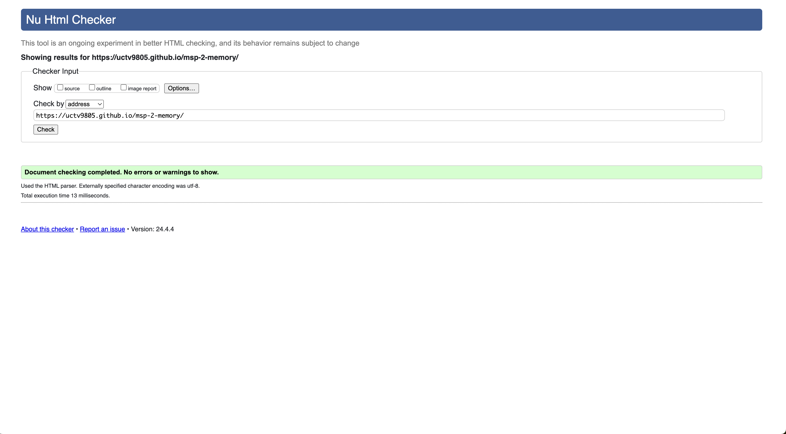
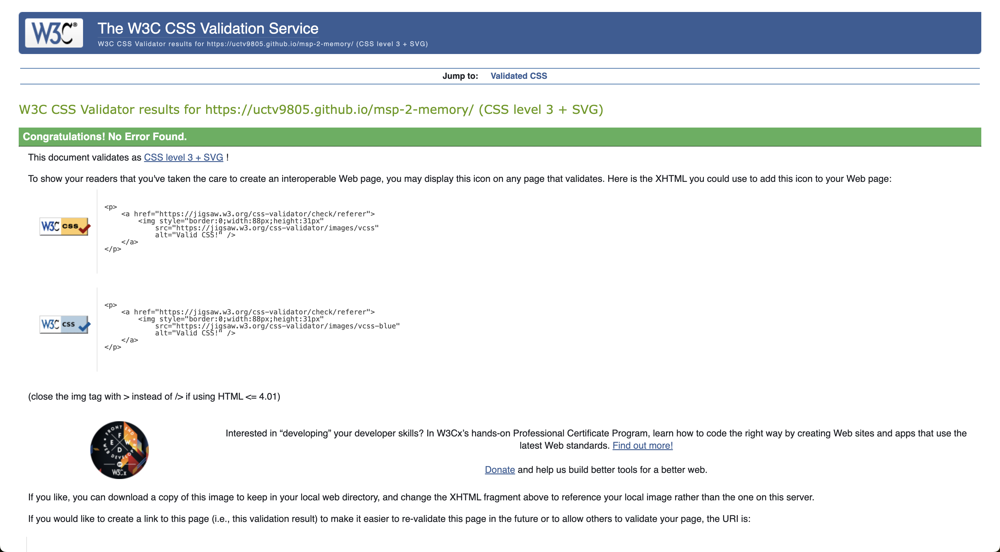
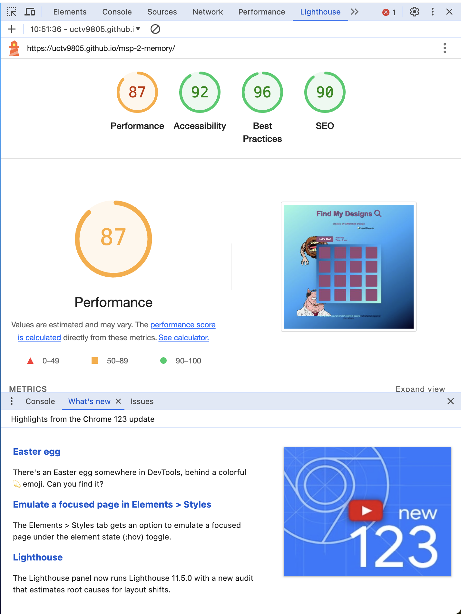

# Testing

## Manual Testing

- I regularly tested elements as I completed them, using the site preview within gitpod I could write the code and then test the site to make sure links worked and the website was responsive.

- I published the page on GitHub pages and then tested the website on different sized devices as well as different brand devices (android/apple/amazon/desktop) 
 to check responsiveness. 

- Let friends and family visit and use the website and report back any unusual findings or problems. 

- I used Chrome Developer tools to simulate different screen sizes in order to test responsiveness.

## Bugs & Fixes

1. Intended Outcome - Use original images on the card backs when they clicked the image would appear. 
    - Issue:
        - Could not get the array to recognise the images - kept showing as the text object and could not figure out how to make it work. 
    - Solution
        - Had to give up and simplfy the game, ended up using emojis so essentially it is just text showing up but at least it is visually more appealing than the words - intend to go back and rectify this in future. 

2. Intended Outcome - Site is responsive across all devices.
    - Issue:
        - Can not get the game board to scale properly on smaller devices such as mobile phone. 
    - Solution
        - Had to remove background images and keep it plain and simple for smaller devices.
    
## Known Bugs

1. There is a bug that occurs when you click the card whilst the animtation of the card turning is happening where it adds a move to the move counter resulting in a higher number of moves being recorded. I have not yet found a solution but I am working on it. 

2. Still having issues with responsiveness on smaller devices - I feel the way to fix it is too big to resolve at this stage and will be a future fix - The game still works on smaller devices and the site is operational. 

# Post Development Testing

## Validator Testing

### HTML
No errors were returned when passing through the official W3C validator
- W3C Validator for 

### CSS
I ran the validator and no errors were reported in my code

- Jigsaw Validator for CSS 

## Lighthouse score

Lighthouse score was run and everything was in the green apart from performance - I am missing out marignally and it seems to be the image sizes - I intend to rectify this soon but ran out of time, I am confident a reduction in image file size will produce good performance.

## Accessibility

As well as the accessibility score from lighthouse testing I also used [WAVE - Web accessability evaluation tool](https://wave.webaim.org/extension/) to check my pages for accessibility and no errors were found.

[Back to README.md](README.md)